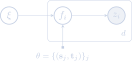

### What Is Bayesian Inference?

1. **Observe** the phenomenon, gather $\mathbf{X} = \left\\{\mathbf{x}\_i\right\\}\_{i=1}^N$, $\mathbf{x}\_i \in \mathbb{R}^D$.
2. **Build** a model, $p(\mathbf{X}, \mathbf{z})$ with latent variables $z\_1, \ldots, z\_d$.
3. **Infer** the posterior, $p(\mathbf{z}| \mathbf{X}) = p(\mathbf{X}, \mathbf{z}) / \int p(\mathbf{X}, \mathbf{z}) \, \mathrm{d}\mathbf{z}$, in order to **reason** about the phenomenon.
4. **Criticize** the model, revise it (->2), or collect additional data (->1).
5. **Apply** the model, i.e. calculate integrals over $p(\mathbf{z}| \mathbf{X})$: expectations of $f(\mathbf{z})$, posterior predictive $p(\mathbf{x}^\*|\mathbf{X})$, etc.

### Why Is Bayesian Inference Hard?

Most posteriors $p(\mathbf{z}| \mathbf{X})$ are not analytically tractable.

A possible solution is numerical estimation via MCMC, e.g. via:
* Metropolis Hastings Sampling,
* Gibbs Sampling,
* Hamiltonian Monte Carlo Sampling,
* No-U-Turn Hamiltonian Monte Carlo Sampling (NUTS).

NUTS is close to exact, but also slow and sequential.

### What Is Variational Inference (VI)?

VI is a class of algorithms which cast posterior inference as optimization:
<ol start="3">
	<li>**Infer** **Approximate** the posterior, $p(\mathbf{z}| \mathbf{X})$:
		<ol style="list-style-type: lower-alpha;">
		  <li>
		  	**Build** a variational model, $q(\mathbf{z}; \mathbf{\lambda})$, over $\mathbf{z}$ with parameters $\mathbf{\lambda}$.
		  </li>
		  <li>
		  	**Match** $q(\mathbf{z}; \mathbf{\lambda})$ to $p(\mathbf{z}| \mathbf{X})$ by optimizing over $\mathbf{\lambda}$,
	      $$
	      	\begin{aligned}
	      		\mathbf{\lambda}^\* & = \, \mathrm{argmin}\_{\mathbf{\lambda}} \; \mathrm{divergence}\left(p(\mathbf{z}| \mathbf{X}), q(\mathbf{z}; \mathbf{\lambda})\right).
	      	\end{aligned}
			  $$
		  </li>
		  <li>
		  	**Use** $q(\mathbf{z}; {\mathbf{\lambda}^\*})$ instead of $p(\mathbf{z}| \mathbf{X})$.
		  </li>
		  <li>
		  	**Criticize** the variational model, revise it (->a).
		  </li>
		</ol>
	</li>
</ol>

Effectively, VI is an additional layer of approximation that facilitates convenient model iteration.

### Matching And Optimizing

The **Kullback-Leibler divergence** from $q$ to $p$ is a good measure for closeness between $p$ and $q$,
$$
	\mathrm{KL}\left(q(\mathbf{z}; \mathbf{\lambda})\\| p(\mathbf{z}\|\mathbf{X})\right) \triangleq \, \mathbb{E}_{q(\mathbf{z}; \mathbf{\lambda})} \left[\log \frac{q(\mathbf{z}; \mathbf{\lambda})}{p(\mathbf{z}\|\mathbf{X})}\right].
$$

**Minimization** of this with respect to $\mathbf{\lambda}$ is intractable, though, because it directly depends on  $p(\mathbf{z}\|\mathbf{X})$.

**Maximize** the Evidence Lower BOund (ELBO) instead,
$$
	\begin{aligned}
		\mathcal{L}(\mathbf{\lambda}) & \triangleq \log p(\mathbf{X}) - \mathrm{KL}\left(q(\mathbf{z}; \mathbf{\lambda})\\| p(\mathbf{z}\|\mathbf{X})\right) \\\\[.5em]
		& = \,\\! \mathbb{E}\_{q(\mathbf{z}; \mathbf{\lambda})} \left[\log p(\mathbf{X}, \mathbf{z})\right] - \,\\! \mathbb{E}\_{q(\mathbf{z}; \mathbf{\lambda})} \left[\log q(\mathbf{z}; \mathbf{\lambda})\right].
	\end{aligned}
$$

### Conventional Variational Modeling

Two conflicting demands:
<ol style="list-style-type:lower-roman;">
  <li>
  	Make $q$ **simpler** than $p$, e.g. choose a factorized multivariate (mean-field) normal distribution,
	  $$
	    q(\mathbf{z}; \mathbf{\lambda}) = \prod\_{i=1}^d \mathcal{N}\left(z\_i; \mu\_{i}, \sigma\_{i}^2\right).
	  $$
	</li>
	<li>
	  Make $q$ more **expressive** so that it can give good results, e.g. choose a full-rank multivariate normal distribution,
  	$$
    	q(\mathbf{z}; \mathbf{\lambda}) = \mathcal{N}\left(\mathbf{z}; \mathbf{\mu}, \mathbf{\Sigma}\right).
  	$$
  </li>
</ol>

### Hierarchical Variational Modeling

<ol start="3" style="list-style-type:lower-roman;">
	<li>
		Use a mean-field distribution, $\prod\_i q(z\_i|\mathbf{\lambda}\_i)$, but softly constrain it by putting a prior $q(\mathbf{\lambda}; \mathbf{\theta})$ on it,
		$$
			q\_{\,\mathrm{HVM}}^{\;}(\mathbf{z}; \mathbf{\theta}) = \int \left[\prod\_{i=1}^d q(z\_i|\mathbf{\lambda}\_i)\right] q(\mathbf{\lambda}; \mathbf{\theta}) \, \mathrm{d}\mathbf{\lambda} \, .
		$$
	</li>
</ol>

Hierarchy captures dependencies between latent variables, $\mathbf{z}$.

More computationally tractable than a variational model with full dependence structure.

Expressiveness is determined by the complexity of $q(\mathbf{\lambda}; \mathbf{\theta})$.

### Variational Gaussian Processes I

Let the mean-field parameters be ${\lambda\_{i}} = f\_i(\mathbf{\xi}) \in \mathbb{R}$, $i = 1, \ldots, d$, where:
* The latent input $\mathbf{\xi} \in {\mathbb{R}^{c}}$ is normally distributed, $\mathbf{\xi} \sim \mathcal{N}(\mathbf{0}, \mathbf{I})$.

* The functions $f\_{i} : {\mathbb{R}^{c}} \to \mathbb{R}$ are distributed according to a **Gaussian process** (GP),
$$
  f\_{i} \sim \left.\mathcal{GP}\left(\mathbf{0}, {\mathbf{K}}\right) \,\\! \right| \mathbf{\theta},
$$
conditioned on a fake data set, $\mathbf{\theta}$, which is not modeled.

Then we draw mean-field samples, i.e. approximate posterior samples $\mathbf{z} \in \mathrm{supp}(p)$, conditioned on the output of the GP draw. 

### Variational Gaussian Processes II

$$
	\textstyle
	\begin{aligned}
		q\_{\,\mathrm{VGP}}^{\;}(\mathbf{z}; \mathbf{\theta}) = \iint & \left[\prod\_{i=1}^d q(z\_i| f\_i(\mathbf{\xi}))\right] \\\\[1.5em] \times & \left[\prod\_{i=1}^d \left.\mathcal{GP}\left(f\_i; \mathbf{0}, {\mathbf{K}}\right) \,\\! \right| \mathbf{\theta}\right] \mathcal{N}(\xi; \mathbf{0}, \mathbf{I}) \, \mathrm{d}\mathbf{f} \, \mathrm{d}\mathbf{\xi} \, .
	\end{aligned}
$$

	

### Gaussian Processes

A Gaussian process is a **generalization** of the Gaussian probability distribution, $\mathcal{N}$.

Given data $\mathbf{\theta} = \\{({\mathbf{s}\_j}, {\mathbf{t}\_j})\\}\_j = \\{\mathbf{S}, \mathbf{T}\\}$, with inputs ${\mathbf{s}\_j} \in {\mathbb{R}^c}$ and outputs ${\mathbf{t}\_j} \in {\mathbb{R}^d}$,
$$
	p({\mathbf{f}}| {\mathbf{\theta}}) = {\prod\_{i=1}^{d}} \left.\mathcal{GP}\left(f\_i; \mathbf{0}, {\mathbf{K}}\right) \,\\! \right| \mathbf{\theta}
$$ forms a **distribution over functions** $\mathbf{f} : {\mathbb{R}^{c}} \to {\mathbb{R}^{d}}$ which interpolate between input-output pairs in $\mathbf{\theta}$.

$\mathbf{K}$ is the covariance matrix or **kernel** of the GP.

### Gaussian Process Kernels

The standard choice is the **automatic relevance determination** kernel,
$$
	\mathbf{K}({\mathbf{S}}, {\mathbf{S}}')\_{jj'} = \eta^2 \, \exp\\!\\!\\!\left[- \sum\_{l=1}^c \rho\_l^2 \left(s\_{jl} - s^{\\!\\!\prime}\_{j'l}\right)^2\right] + \delta\_{\mathbf{s}\_j \mathbf{s}'\_{j'}} \sigma^2,
$$
where $\delta\_{\mathbf{s}\_j \mathbf{s}'\_{j'}}$ is meant with respect to the identity of the points.

The more similar $\mathbf{s}\_j$ and $\mathbf{s}'\_{j'}$, the more similar $\mathbf{f}(\mathbf{s}\_j)$ and $\mathbf{f}(\mathbf{s}'\_{j'})$.

The larger $\rho\_l$, the larger the weight on dimension $l$.

$\eta$ is the scale of the outputs $\mathbf{T}$.

$\sigma$ is the scale of the noise in $\mathbf{T}$.

### Gaussian Process Prediction

The distribution of the function's value at a finite number of test inputs, $\mathbf{S}^{\*}$, is a multivariate normal distribution,
$$
	\begin{aligned}
		\mathbf{T}^{\*}\_{i} \, | \, \mathbf{S}, \mathbf{T}, {\mathbf{S}^{\*}} \sim \mathcal{N}\bigl(&\mathbf{K}({\mathbf{S}^{\*}}, {\mathbf{S}}) \, \mathbf{K}({\mathbf{S}}, {\mathbf{S}})^{-1} \, \mathbf{T}\_i, \\\\[.5em] & \mathbf{K}({\mathbf{S}^{\*}}, {\mathbf{S}^{\*}}) - \mathbf{K}({\mathbf{S}^{\*}}, {\mathbf{S}}) \, \mathbf{K}({\mathbf{S}}, {\mathbf{S}})^{-1} \, \mathbf{K}({\mathbf{S}}, {\mathbf{S}^{\*}})\bigr),
	\end{aligned}
$$
where $\mathbf{T}\_{i}$ ($\mathbf{T}^{\*}\_{i}$) are (test) outputs for the $i$-th output dimension. 

### Gaussian Process Joint Distribution

The joint distribution of the observed target values and the function values at the test locations can be written as:
$$
	\left.
	\begin{pmatrix}
		\mathbf{T}\_{i} \\\\
		\mathbf{T}^{\*}\_{i}
	\end{pmatrix}
	\right| \, \mathbf{S}, {\mathbf{S}^{\*}}
	\sim \mathcal{N}\left[
		\mathbf{0},
		\begin{pmatrix}
			\mathbf{K}({\mathbf{S}}, {\mathbf{S}}) & \mathbf{K}({\mathbf{S}}, {\mathbf{S}^{\*}}) \\\\
			\mathbf{K}({\mathbf{S}^{\*}}, {\mathbf{S}}) & \mathbf{K}({\mathbf{S}^{\*}}, {\mathbf{S}^{\*}})
		\end{pmatrix}
	\right].
$$

# Demonstration

### What Is The Target Function in The VGP?

Just for now, assume that the variational likelihood $q(\mathbf{z}| \mathbf{f}(\mathbf{\xi}))$ is a point mass distribution,
$$
  q(\mathbf{z}| \mathbf{f}(\mathbf{\xi})) = \delta\\!\left(\mathbf{z} - \mathbf{f}(\mathbf{\xi})\right).
$$

Then, with the GP, we want to approximate a function, $\mathbf{f}^\*$, that, when applied to draws $\mathbf{\xi} \sim \mathcal{N}(\mathbf{0}, \mathbf{I})$, produces samples $\mathbf{z} = {\mathbf{f}^\*(\mathbf{\xi})}$ that are distributed as the posterior $p(\mathbf{z}| \mathbf{X})$, i.e. effectively
$$
	p(\mathbf{z}| \mathbf{X}) = \int\_{\mathbb{R}^c} \delta\\!\left(\mathbf{z} - {\mathbf{f}^{\*}(\mathbf{\xi})}\right) \mathcal{N}(\xi; \mathbf{0}, \mathbf{I}) \, \mathrm{d}\mathbf{\xi}.
$$

### Explicit Construction of $\mathbf{f}^\*$ I

<ol>
	<li>
		Integrate on both sides:
		$$
			\begin{aligned}
				p(\mathbf{z}'| \mathbf{X}) & = \int\limits\_{\mathbb{R}^c} \delta\\!\left(\mathbf{z}' - {\mathbf{f}^{\*}(\mathbf{\xi}')}\right) \mathcal{N}(\xi'; \mathbf{0}, \mathbf{I}) \, \mathrm{d}\mathbf{\xi}', \\\\[2em]
			  \int\limits\_{\\{{z'\_i} \le {f^{\*}\_{i}(\mathbf{\xi})}\\}\_i^{\phantom{\prime}}} \\!\\!\\!\\!\\!\\!\\! p(\mathbf{z}'| \mathbf{X}) \, \mathrm{d}\mathbf{z}' & = \int\limits\_{\mathbb{R}^c} \; \int\limits\_{\\{{z'\_i} \le {f^{\*}\_{i}(\mathbf{\xi})}\\}\_i^{\phantom{\prime}}} \\!\\!\\!\\!\\!\\!\\! \delta\\!\left(\mathbf{z}' - {\mathbf{f}^{\*}(\mathbf{\xi}')}\right) \mathrm{d}\mathbf{z}' \; \mathcal{N}(\xi'; \mathbf{0}, \mathbf{I}) \, \mathrm{d}\mathbf{\xi}'.
		  \end{aligned}
		$$
	</li>
	<li>
	  The LHS is, by definition, the posterior cumulative density function, $P(\mathbf{z}|\mathbf{X})  \triangleq \mathbb{P}(\mathbf{z}' \le \mathbf{z}| \mathbf{X})$, evaluated at $\mathbf{z} = {\mathbf{f}^{\*}(\mathbf{\xi})}$.
	</li>
	<li>
	  The inner integral over $\mathbf{z}'$ on the RHS reduces to the Heaviside function, $\Theta$, evaluated at $\mathbf{f}^{\*}(\mathbf{\xi}) - {\mathbf{f}^{\*}(\mathbf{\xi}')}$.
	</li>
</ol>

### Explicit Construction of $\mathbf{f}^\*$ II

<ol start="4">
	<li>
		The Heaviside function reduces the integration domain of the remaining integral over $\mathbf{\xi}'$ on the RHS:
		$$
			P\left({\mathbf{f}^{\*}(\mathbf{\xi})}|\mathbf{X}\right) \; = \\!\\!\\!\\!\\!\\!\\!\\!\\!\\!\\!\\!\\!\\!\\!\\!\\!\\!\\!\\!\\! \int\limits\_{\\{\mathbf{\xi}' : {f\_i^{\*}(\mathbf{\xi}')} \le {f\_i^{\*}(\mathbf{\xi})}, \, i=1,\ldots,d\\}} \\!\\!\\!\\!\\!\\!\\!\\!\\!\\!\\!\\!\\!\\!\\!\\!\\!\\!\\! \mathcal{N}(\xi'; \mathbf{0}, \mathbf{I}) \; \mathrm{d}\mathbf{\xi}'.
		$$
	</li>
	<li>
		At this point, I wish I had evidence that allowed me to replace the integration domain with $\\{{\mathbf{\xi}'} : {\mathbf{\xi}'\_l} \le {\mathbf{\xi}\_l}, \, l=1,\ldots,c\\}$,
		because then the RHS would reduce to the standard multivariate normal cumulative distribution function, $\Phi$, evaluated at $\mathbf{\xi}$. We would then have ${\mathbf{f}^{\*}(\mathbf{\xi})} = {\mathbf{P}^{-1}(\Phi(\mathbf{\xi}))} \triangleq {\\{\mathbf{z} : P(\mathbf{z}| \mathbf{X}) = \Phi(\mathbf{\xi})\\}}$.   **But I don't have that evidence :(**
	</li>
</ol>
</ol>

### VGP Approximation Theorem

*Let* $q\_{\,\mathrm{VGP}}^{\;}(\mathbf{z}; \mathbf{\theta})$ *denote the variational Gaussian process. Let* $p(\mathbf{z}| \mathbf{X})$ *be a posterior distribution with a finite number of latent variables and continuous quantile function (inverse cumulative distribution function),* $\mathbf{P}^{-1}(\mathbf{z})$*. Then there exists a sequence of parameters* $\mathbf{\theta}\_m$ *such that*
$$
  \lim\_{m\to\infty} \mathrm{KL}\left(q\_{\,\mathrm{VGP}}^{\;}(\mathbf{z}; {\mathbf{\theta}\_m})\\| p(\mathbf{z}\|\mathbf{X})\right) = 0.
$$
 

Every posterior with strictly positive density $p(\mathbf{z}| \mathbf{X})$ can be represented by a VGP (because those always have continuous quantile functions).

### Black Box Inference

Unfortunately, the ELBO,
$$
	\mathcal{L} = \,\\! \mathbb{E}\_{q\_{\,\mathrm{VGP}}^{\;}(\mathbf{z}; \mathbf{\theta})} \left[\log p(\mathbf{X}, \mathbf{z})\right] - \,\\! \mathbb{E}\_{q\_{\,\mathrm{VGP}}^{\;}(\mathbf{z}; \mathbf{\theta})} \left[\log q\_{\,\mathrm{VGP}}^{\;}(\mathbf{z}; \mathbf{\theta})\right],
$$
is not analytically tractable because of the log-density $\log q\_{\,\mathrm{VGP}}^{\;}(\mathbf{z}; \mathbf{\theta})$.

The paper derives a weaker lower bound for the log-evidence,
$$
	\begin{aligned}
  	\mathcal{\tilde{L}} \triangleq & \; \mathbb{E}\_{q\_{\,\mathrm{VGP}}^{\;}(\mathbf{z}; \mathbf{\theta})} \left[\log p(\mathbf{X}| \mathbf{z})\right] \\\\[.75em]
  	& - \,\\! \mathbb{E}\_{q\_{\,\mathrm{VGP}}^{\;}(\mathbf{z}; \mathbf{\theta})} \left[\mathrm{KL}\bigl(q(\mathbf{z}| \mathbf{f}(\mathbf{\xi}))\\| p(\mathbf{z})\bigr) + \mathrm{KL}\bigl(q(\mathbf{\xi}, \mathbf{f})\\| r(\mathbf{\xi}, \mathbf{f}|\mathbf{z})\bigr)\right],
  \end{aligned}
$$
and shows how to maximize that instead, where $r$ is an auxiliary distribution...

...

### Algorithm Complexity

$$
  \mathcal{O}(d + m^3 + L H^2),
$$
where:
* $d$ is the number of latent variables,
* $m$ is the size of the fake data set $\mathbf{\theta}$,
* $L$ is the number of layers of a neural network leveraged for optimization with
* $H$ the average hidden layer size.

# How Do We Use This?

### We Don't (For Now)

<blockquote class="twitter-tweet" data-lang="en">
<a href="https://twitter.com/dustinvtran">@dustinvtran</a> is Edward implementing the VGP from your ICLR 2016 paper? I looked through the code and couldn&#39;t find it anywhere.
&mdash; Torsten Scholak (@tscholak) <a href="https://twitter.com/tscholak/status/764125824861741072">August 12, 2016</a></blockquote> 

<blockquote class="twitter-tweet" data-lang="en">
<a href="https://twitter.com/tscholak">@tscholak</a> thanks for asking! its in a private branch at the moment, waiting for api changes to enable more expressive variational models
&mdash; Dustin Tran (@dustinvtran) <a href="https://twitter.com/dustinvtran/status/764165635974717440">August 12, 2016</a></blockquote> 